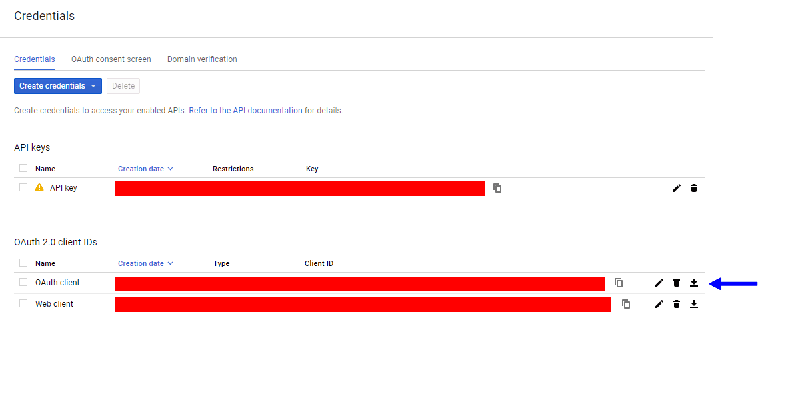

# google-drive-dwn (Google Drive File Downloader)

## Purpose

`google-drive-dwn` is a simple way to download a shared file from Google Drive.

The module can perform:

* downloading files with binary content
* downloading Google Doc files and convert them to the specified format
* restricting maximum file size
* assigning unique file names

> Note: This module was developed for **Google Drive API v3**

You can use the module to download files one by one. This doesn't support multiple downloading.

## Installation

Before starting you have to install `googleapis`

`npm install googleapis@27 --save`

When `googleapis` has been installed you can run: 

`npm install google-drive-dwn --save`

> NOTE: During the installation you will be asked for a few questions. So you should be prepared.

### 1. Please put credentials.json in the root of your app and press Enter

At this point, you should enable the Drive API, download JSON-file (Google Console - APIs & Services - Credentials) and ensure it is named `credentials.json` (see below)



Put the file and press Enter

### 2. Enter the scopes

[List of scopes](https://developers.google.com/drive/api/v3/about-auth)

If you want to enter more then one scope you should separate them with a comma

For example: `https://www.googleapis.com/auth/drive.readonly,https://www.googleapis.com/auth/drive.metadata`

### 3. Browse to the provided URL in your web browser.

> If you are not already logged into your Google account, you will be prompted to log in. If you are logged into multiple Google accounts, you will be asked to select one account to use for the authorization.

Click the Accept button.

Copy the code you're given, paste it into the command-line prompt, and press Enter.

It will create a `token.json` in the root of your app

## After installation

Now you can move and/or rename the files `credentials.json` and `token.json`

You will need them later when you are ready to use the module.

## Usage

```
const googleDrive = require('google-drive-dwn')
const drive = googleDrive(config)
...
const result = await drive('fileId')
```
The config is an object that contains the following properties: 

| Name | Type | Description |
| --- | --- | --- |
| scopes| Array| You should use the same scopes that you entered during installation |
| credentialsPath| String | The path to your credential file |
| tokenPath| String | The path to the created token file |
| fileDir| String | The directory for downloading |
| mimeTypes| Object | The list of mimeTypes |
| maxFileSize| Number | The size of the file's content in bytes |


> It returns TRUE true if successful.

**Example:**

```
const googleDrive = require('google-drive-dwn');

const drive = googleDrive({
    scopes: ['https://www.googleapis.com/auth/drive.readonly'],
    tokenPath: './sensitive_data/credentials.json',
    credentialsPath: './sensitive_data/token.json',
    fileDir: './statics/files',
    mimeTypes: {
      "application/vnd.google-apps.document": {
        "ext": "docx",
        "exportType": "application/vnd.openxmlformats-officedocument.wordprocessingml.document"
      },
      "application/vnd.google-apps.spreadsheet": {
        "ext": "xlsx",
        "exportType": "application/vnd.openxmlformats-officedocument.spreadsheetml.sheet"
      },
      "application/msword": {
        "ext": "doc"
      },
      "application/vnd.ms-excel": {
        "ext": "xls"
      },
      "application/pdf": {
        "ext": "pdf"
      },
      "image/png": {
        "ext": "png"
      },
      "image/jpeg": {
        "ext": "jpg"
      }
    },
    maxFileSize: 5e+7
});

drive('fileId')
  .then(res => console.log(res))
  .catch(err => console.error(err))

```

